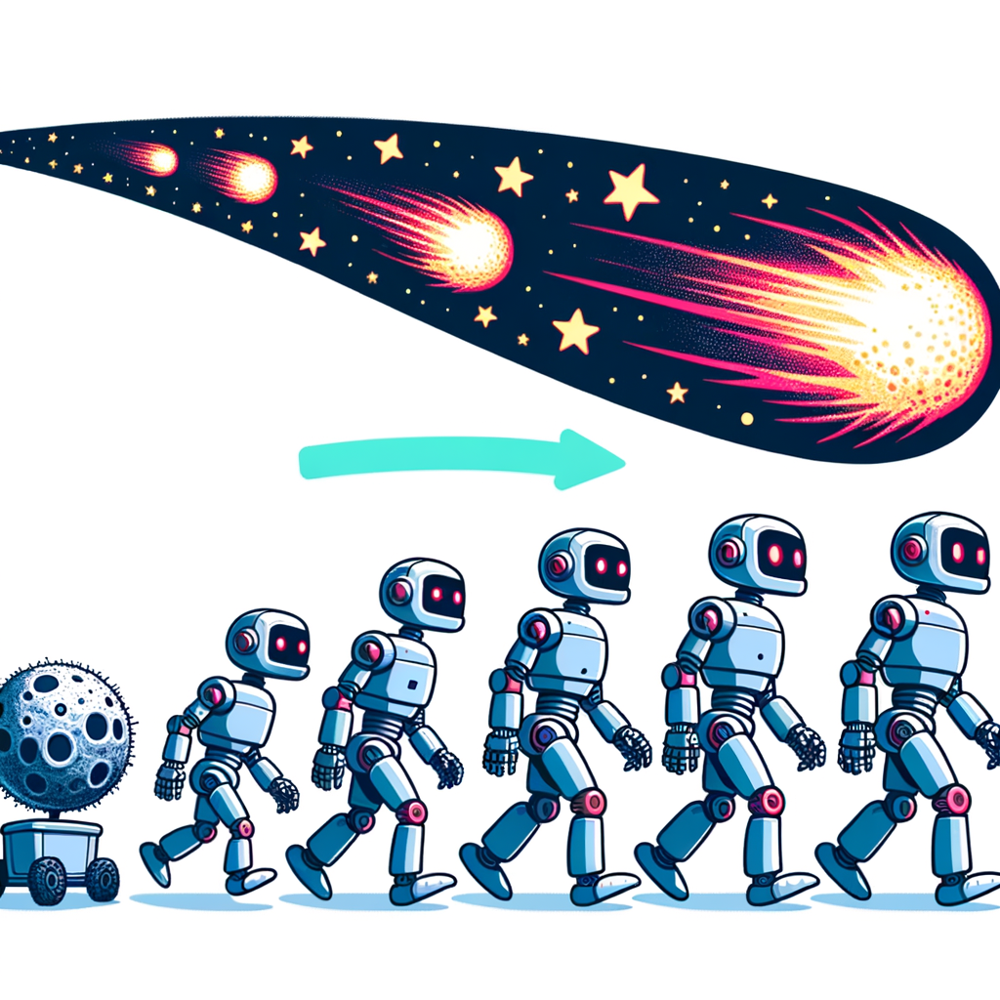
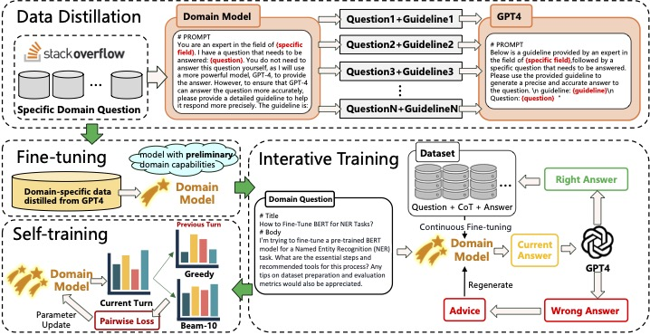

# METEOR: Evolutionary Journey of Large Language Models from Guidance to Self-Growth
<p align="center">        </p>

<p align="center">
  📄 <a href="https://arxiv.org/abs/2411.11933" target="_blank">Paper</a> &nbsp; | &nbsp;
  💻 <a href="./code" target="_blank">Code</a> &nbsp; | &nbsp;
  🎰 <a href="./code/data/raw" target="_blank">Datasets</a> &nbsp;
</p>


## Contents
- [METEOR: Evolutionary Journey of Large Language Models from Guidance to Self-Growth](#pspo-an-effective-process-supervised-policy-optimization-for-reasoning-alignment)
  - [**Contents**](#contents)
  - [📝 **Introduction**](#-introduction)
  - [📈**Main Results**](#overall-results)
  - [🔍**Methodology**](#methodology)
  - [🔬**Quick Start**](#quick-start)
  - [📃**License**](#license)
  - [🌟**Citation**](#citation)


## 📝 Introduction
**METEOR: Evolutionary Journey of Large Language Models from Guidance to Self-Growth** a **weak-to-strong evolution framework** that enables LLMs to progressively evolve from supervised guidance to autonomous enhancement. METEOR introduces a comprehensive **three-stage evolution framework** that guides models from **basic domain knowledge acquisition** through supervised learning to **autonomous capability enhancement** via progressive computational scaling.

## 📈**Main Results**
| Model | Accuracy | Completeness | Relevance | Coherence | Reliability | GPT-4 Score |
|-------|----------|--------------|-----------|-----------|-------------|-------------|
|LLaMA3 w/o METEOR| 21.3% | 27.8% | 25.6%     | 19.9%     | 17.8%       | 5.02        |
|LLaMA3 w METEOR  | **78.7%** |**72.2%**|**74.4%**|**80.1%**|**82.2%**  | **9.17**    |
| Qwen2 w/o METEOR| 31.6% | 36.5% | 39.7%     | 36.5%     | 32.9%       | 6.88        |
| Qwen2 w METEOR  | **68.4%** |**63.5%**|**60.3%**|**63.5%**|**63.5%**  | **9.28**    |

We compared the performance changes across various dimensions before and after applying the Meteor method for domain capability evolution of LLMs. For the **accuracy, completeness, relevance, coherence, and reliability**, we generated responses to test set questions using both the Meteor-trained LLMs and the non-Meteor-trained LLMs. As shown in this table, after the Meteor evolution, [LLaMA3-8B-Instruct](https://huggingface.co/meta-llama/Meta-Llama-3-8B-Instruct) and [Qwen2-7B-Instruct](https://huggingface.co/Qwen/Qwen2-7B-Instruct) achieved improvements. dditionally, the GPT-4 Score after evolution was significantly higher than before, demonstrating the effectiveness of the Meteor method.

  
## 🔍**Methodology**
<p align="center">    <br> <em>The overall method of METEOR.</em>    </p>

The METEOR method consists of three distinct phases: **weak-to-strong data distillation, iterative training, and self-training strategies.** In each phase, the model fully utilizes its existing capabilities to strengthen its domain expertise. Each subsequent phase builds upon the advancements made in the previous one, employing different techniques to further evolve the model. 

## 🔬**Quick Start**

#### **Download Data**
We use the field of advanced computer education as the specific domain to validate the effectiveness of the proposed Meteor method. To obtain high-quality domain data, we scraped data from Stack Overflow across four categories: Machine Learning (ML), Deep Learning (DL), Natural Language Processing (NLP), and Computer Vision (CV), totaling 10,276 entries.
| Category     | ML  | DL | NLP | CV | TOTAL  |
|--------------|-----|----|-----|----|--------|
|Scale         |4605 |2092|1881 |1698| 10276  |

You can download the crawded domain data [here](https://github.com/DirectionAI/METEOR/tree/main/code/data/raw).

#### Stage1: Weak-to-strong Domain Data Distillation

**Guideline Generation:** Run the following instructions to obtain the guideline for generating domain data with the LLMs:

```bash
CUDA_VISIBLE_DEVICES=0 python get_guideline.py \
    --model_path "models/llama3-8b-chat" \
    --data_folder "data/raw_data" \
    --out_folder "outputs/guidelines" \
    --batch_size 4
```

You can get the *guidelines.jsonl* at the out_folder.

**Data Distillation:** Combine domain-specific questions with their corresponding guidelines, call the GPT-4 API, and distill high-quality domain data.

```bash
python get_distill_data.py \
    --data_folder "outputs/guidelines" \
    --out_folder "outputs/distilled_data" \
    --api_key 'your-api-key'
```

**Domain Fine-tuning:** Fine-tune the model using distilled high-quality domain data to enable it to perform domain-specific tasks effectively.
```bash
deepspeed --include localhost:0,1,2,3 --master_port=29902 finetune.py \
    --model_name_or_path "models/llama3-8b-chat" \
    --train_data_path "outputs/distilled_data/distilled_data.jsonl" \
    --output_dir "outputs/fine_tuned_model" \
    --per_device_train_batch_size 1 \
    --per_device_eval_batch_size 1 \
    --gradient_accumulation_steps 8 \
    --learning_rate 3e-5 \
    --num_train_epochs 3 \
    --fp16 \
    --deepspeed "configs/ds_config_stage2.json" \
    --overwrite_output_dir \
    --max_seq_length 512
```

#### Stage2: Data Refinement and Iterative Training for Domain-Specific Models

**Data Refinement:** Upon receiving domain-specific data, the model employs CoT reasoning to generate answers and reasoning paths. These are evaluated by GPT-4, which provides confirmation if correct or offers suggestions for refinement if incorrect.
```bash
python get_iterative_training_dataset.py \
    --model_path "models/fine_tuned_model" \
    --data_path "outputs/distilled_data/distilled_data.jsonl" \
    --out_folder "outputs/iterative_data" \
    --api_key 'your-api-key' \
    --max_iterations 3 \
    --batch_size 4
```

An example demonstrating how GPT-4 corrects answers and generates final data:

<details><summary><b>Case：</b></summary>
Title: Understanding Overfitting in Machine Learning

Content:

Can someone explain what overfitting is in machine learning and how it can be prevented? I'm trying to understand why my model performs well on training data but poorly on new, unseen data.

2. Model's Initial Answer
Answer with Reasoning:

Overfitting in machine learning occurs when a model learns the training data too well, including its noise and outliers. As a result, it performs exceptionally on the training data but poorly on new, unseen data because it hasn't learned the underlying general patterns.

To prevent overfitting, you can:

Use a simpler model: Reduce the complexity of the model to avoid capturing noise.
Gather more data: More training data helps the model learn more general features.
Feature selection: Remove irrelevant features that may introduce noise.
Data augmentation: Artificially expand your dataset by modifying existing data.
By implementing these methods, your model should generalize better to new data.

3. GPT-4 Feedback
Evaluation:

The explanation of overfitting is generally correct; however, there are some issues:

Data Augmentation: While data augmentation is common in fields like image processing, it might not be applicable or effective for all types of data.
Missing Regularization Techniques: The answer lacks mention of regularization methods such as L1/L2 regularization, dropout, or early stopping, which are standard techniques to prevent overfitting.
Hint for Improvement:

Include regularization techniques as methods to prevent overfitting.
Clarify when data augmentation is appropriate.
4. Iterative Refinement
Revised Answer with Reasoning:

Overfitting occurs when a machine learning model learns the training data, including its noise and specific patterns, too closely. This leads to excellent performance on training data but poor generalization to new, unseen data.

To prevent overfitting, you can:

Cross-Validation: Use techniques like k-fold cross-validation to ensure the model performs well on different subsets of data.
Regularization Techniques:
L1/L2 Regularization: Add a penalty term to the loss function to discourage complex models.
Dropout: Randomly ignore neurons during training to prevent co-adaptation.
Early Stopping: Stop training when performance on a validation set begins to degrade.
Simplify the Model: Use models with fewer parameters to reduce complexity.
Gather More Data: More data can help the model learn more general patterns.
Data Augmentation (when applicable): For datasets like images, augment data by transformations like flipping or rotation to increase diversity.
By applying these methods, your model is more likely to generalize well to new data and perform better on unseen datasets.

5. GPT-4 Final Evaluation
Evaluation:

Correct.

The revised answer accurately explains overfitting and includes comprehensive methods to prevent it. The addition of regularization techniques and clarification on data augmentation enhance the quality of the response.
</details>


**Iterative Training:** Once the accumulated data reaches an integer multiple of $10$, use this batch of data to fine-tune the model.

```bash
python get_iterative_training_dataset.py \
    --model_path "models/fine_tuned_model" \
    --data_path "outputs/distilled_data/distilled_data.jsonl" \
    --out_folder "outputs/iterative_data" \
    --api_key 'your-api-key' \
    --max_iterations 3 \
    --fine_tune_script "finetune.py" \
    --fine_tune_args "--per_device_train_batch_size 1 --gradient_accumulation_steps 8 --learning_rate 3e-5 --num_train_epochs 1 --fp16 --deepspeed configs/ds_config_stage2.json --overwrite_output_dir --max_seq_length 512" \
    --fine_tune_interval 10 \
    --gpu_devices "0,1,2,3"
```
Enable the model to perform self-assessment through iterative training under the guidance of GPT-4.

#### Stage3: Self-training
Once the model has acquired the ability for self-evolution, and based on the theory that higher computational complexity (FLOPs) during the reasoning process leads to better performance, we have designed a self-training method based on contrastive learning, enabling the model to autonomously enhance its own capabilities.

```bash
deepspeed --include localhost:0 --master_port=29902 self_training.py \
    --model_path "outputs/iterative_model" \
    --data_path "outputs/iterative_data/iterative_training_data.jsonl" \
    --out_folder "outputs/self_trained_model" \
    --per_device_train_batch_size 1 \
    --gradient_accumulation_steps 8 \
    --learning_rate 1e-5 \
    --num_train_epochs 1 \
    --fp16 \
    --deepspeed "configs/ds_config_stage2.json" \
    --overwrite_output_dir \
    --max_seq_length 512
```

#### **Metrics**
  We use GPT-4 as a judge to evaluate both data quality and model performance. When comparing the distilled data quality with and without the use of guidelines, GPT-4 is used to score the data, where higher scores indicate better quality. In evaluating the domain-specific answers generated by the model, GPT-4 provides scores based on five criteria: accuracy, completeness, relevance, coherence, and reliability, allowing for a comprehensive assessment of the model's domain capabilities.

#### **Evaluation**
For the accuracy, completeness, relevance, coherence, and reliability, we generated responses to test set questions using both the Meteor-trained LLMs and the non-Meteor-trained LLMs. We utilize the GPT-4 API to evaluate these dimensions.

```bash
python evaluate.py \
    --model_paths "models/meteor_trained_model" "models/baseline_model" \
    --test_data_path "data/test_data.jsonl" \
    --output_dir "outputs/evaluation" \
    --api_key 'your-api-key' \
    --batch_size 4 \
    --max_eval_samples 100
```

evaluate example:

```json
{
    "question": "Explain the concept of overfitting in machine learning.",
    "answers": {
        "meteor_trained_model": "Overfitting occurs when a machine learning model learns the training data too well...",
        "baseline_model": "Overfitting is when a model performs well on training data but poorly on new data..."
    },
    "evaluation": [
        {
            "Answer": 1,
            "Accuracy": 9,
            "Completeness": 8,
            "Relevance": 10,
            "Coherence": 9,
            "Reliability": 9,
            "Justification": "The answer accurately explains overfitting and provides relevant details..."
        },
        {
            "Answer": 2,
            "Accuracy": 7,
            "Completeness": 6,
            "Relevance": 8,
            "Coherence": 7,
            "Reliability": 7,
            "Justification": "The answer gives a basic definition but lacks depth and specific examples..."
        }
    ]
}
```

## 📃License

The code in this repo is licensed by [Apache 2.0](./LICENSE.txt), the data on huggingface and this repo are licensed by [CC BY-NC 4.0](./DATA_LICENSE.txt), the model weights on huggingface are licensed by [GNU AGPL 3.0](./MODEL_LICENSE.txt). To use the models in this project for commercial purposes or public deployment, please sign this [document](./images/Agreement.pdf) and complete this [questionnaire](https://zg5p4zcqlu.feishu.cn/share/base/form/shrcndUD6XiEhFfwI36QmdmMjzd) to obtain authorization. We only track the commercial use but charge nothing. The service provider shall be responsible for misleading or injurious statements and adverse effects caused by the use of the models contained in this repo and their modified versions.


## 🌟Citation
If you find our work useful, please consider citing the following papers:

```
@misc{li2024meteorevolutionaryjourneylarge,
      title={METEOR: Evolutionary Journey of Large Language Models from Guidance to Self-Growth}, 
      author={Jiawei Li and Chong Feng and Yang Gao},
      year={2024},
      eprint={2411.11933},
      archivePrefix={arXiv},
      primaryClass={cs.LG},
      url={https://arxiv.org/abs/2411.11933}, 
}
```
